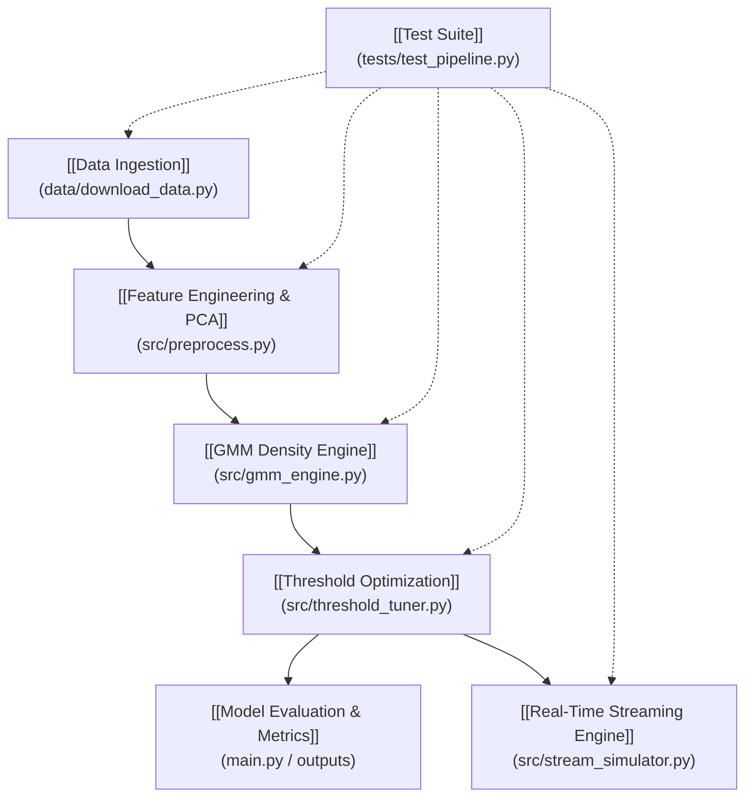

# 🏛️ Architecture Overview: Net-GMM Anomaly Detection

> **Vault Hub**: [[README]]  
> **Core Subsystems**: [[Data Ingestion]] | [[Feature Engineering & PCA]] | [[GMM Density Engine]] | [[Threshold Optimization]] | [[Model Evaluation & Metrics]] | [[Real-Time Streaming Engine]] | [[Test Suite]]

The **Net-GMM Anomaly Detection System** is an end-to-end unsupervised cybersecurity pipeline engineered for detecting zero-day and anomalous network intrusions using statistical Gaussian density estimation on dimensionally reduced network telemetry.

---

## 🗺️ Subsystem Map & Dependencies

---

## 📦 Architectural Components

1. **Data Layer**:
   - [[Data Ingestion]]: Downloads, verifies, and splits `KDDTrain+.txt` and `KDDTest+.txt` under strict unsupervised baseline rules (normal traffic only for training).

2. **Feature & Transformation Layer**:
   - [[Feature Engineering & PCA]]: Applies right-skew log transforms $\ln(1+x)$, categorical One-Hot Encoding, StandardScaler, and PCA dimensionality reduction ($\ge 95\%$ cumulative variance). Serialized to `models/preprocessor.joblib`.

3. **Probabilistic Modeling Layer**:
   - [[GMM Density Engine]]: Executes a grid search across candidate components $K \in [1, 10]$, computes BIC/AIC information criteria, and fits full-covariance Gaussian Mixture Models using the Expectation-Maximization (EM) algorithm. Serialized to `models/gmm_model.joblib`.

4. **Decision Theory & Inference Layer**:
   - [[Threshold Optimization]]: Scans percentile thresholds and optimizes the log-likelihood decision boundary $\epsilon^*$ to maximize validation $F_1$-score.

5. **MLOps Streaming & Evaluation Layer**:
   - [[Model Evaluation & Metrics]]: Benchmarks performance on unseen holdout test data (Precision: 92.34%, Recall: 93.31%, $F_1$: 92.82%, ROC-AUC: 0.9652).
   - [[Real-Time Streaming Engine]]: Real-time packet ingestion simulator emitting structured ISO-8601 JSON alerts to `outputs/alerts.json`.
   - [[Test Suite]]: Automated unit and integration test suite with 100% test pass rate.

---

## 🔗 Related Notes
- [[Data Ingestion]]
- [[Feature Engineering & PCA]]
- [[GMM Density Engine]]
- [[Threshold Optimization]]
- [[Model Evaluation & Metrics]]
- [[Real-Time Streaming Engine]]
- [[Test Suite]]
