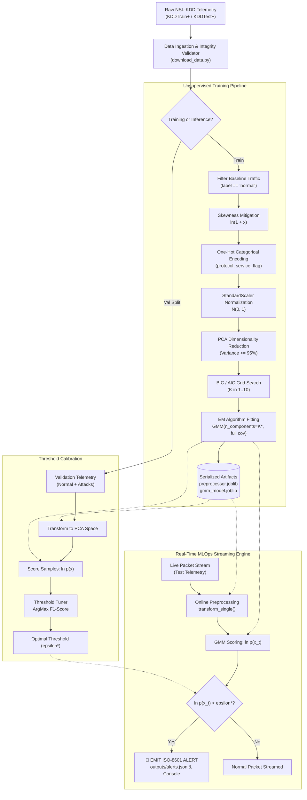

# 🛡️ Unsupervised Network Anomaly Detection via GMM & PCA on NSL-KDD

> **Obsidian Knowledge Map**: [[Architecture Overview]] | [[Data Ingestion]] | [[Feature Engineering & PCA]] | [[GMM Density Engine]] | [[Threshold Optimization]] | [[Model Evaluation & Metrics]] | [[Real-Time Streaming Engine]] | [[Test Suite]]

A production-grade, modular Python machine learning and MLOps system for **unsupervised network intrusion telemetry anomaly detection**. The system trains an Expectation-Maximization Gaussian Mixture Model (GMM) with full covariance topologies on clean baseline network traffic conditioned via right-skew log-transforms, StandardScaler, and Principal Component Analysis (PCA $\ge 95\%$ variance retention). Decision boundaries are mathematically calibrated using validation $F_1$-score maximization, and streaming telemetry is processed in real time with ISO-8601 JSON security alerts.

---

## 📐 Mathematical Formulation

### 1. Feature Conditioning & Dimensionality Reduction
- **Right-Skew Mitigation**: Heavy-tailed continuous network attributes ($x \ge 0$) like `duration`, `src_bytes`, `dst_bytes`, `count`, and `srv_count` undergo log-1-plus transformation:
  $$\tilde{x} = \ln(1 + x)$$
- **Standardization**: Centered and scaled with zero mean and unit variance based strictly on normal baseline statistics:
  $$z = \frac{\tilde{x} - \mu_{\text{train}}}{\sigma_{\text{train}}}$$
- **Principal Component Analysis (PCA)**: Given the covariance matrix $C = \frac{1}{N} Z^T Z = V \Lambda V^T$, we project $z \in \mathbb{R}^D$ into orthogonal subspace $z_{\text{pca}} \in \mathbb{R}^d$ such that:
  $$\frac{\sum_{i=1}^d \lambda_i}{\sum_{j=1}^D \lambda_j} \ge 0.95$$

---

### 2. Gaussian Mixture Density Estimation (EM Algorithm)
The baseline probability density of normal traffic in the PCA latent space is modeled as a convex combination of $K$ multivariate Gaussian distributions:
$$p(x) = \sum_{k=1}^K \pi_k \mathcal{N}(x \mid \mu_k, \Sigma_k) = \sum_{k=1}^K \pi_k \frac{1}{(2\pi)^{d/2} |\Sigma_k|^{1/2}} \exp\left(-\frac{1}{2}(x - \mu_k)^T \Sigma_k^{-1} (x - \mu_k)\right)$$

Where $\sum_{k=1}^K \pi_k = 1$ and $\pi_k \ge 0$.

#### Expectation-Maximization (EM) Convergence
1. **E-Step (Posterior Responsibility)**:
   $$\gamma_{ik} = \frac{\pi_k \mathcal{N}(x_i \mid \mu_k, \Sigma_k)}{\sum_{j=1}^K \pi_j \mathcal{N}(x_i \mid \mu_j, \Sigma_j)}$$
2. **M-Step (Parameter Updates)**:
   $$N_k = \sum_{i=1}^N \gamma_{ik}, \quad \mu_k = \frac{1}{N_k}\sum_{i=1}^N \gamma_{ik} x_i, \quad \Sigma_k = \frac{1}{N_k}\sum_{i=1}^N \gamma_{ik}(x_i - \mu_k)(x_i - \mu_k)^T, \quad \pi_k = \frac{N_k}{N}$$

---

### 3. Model Topology Selection: BIC & AIC
To prevent underfitting and overparameterization, $K \in [1, 10]$ is searched systematically:
$$\text{BIC} = -2 \ln \hat{L} + p \ln(N)$$
$$\text{AIC} = -2 \ln \hat{L} + 2p$$
Where $\hat{L} = \prod_{i=1}^N p(x_i)$, and $p = K - 1 + Kd + K \frac{d(d+1)}{2}$ represents the total number of free parameters for full covariance matrices.

---

### 4. Decision Theory & Threshold Optimization
Incoming network records are evaluated against the log-likelihood score $\ln p(x)$. Out-of-distribution events (attacks) exhibit significantly lower density:
$$\hat{y}(x) = \begin{cases} 1 \ (\text{Anomaly / Attack}), & \text{if } \ln p(x) < \epsilon \\ 0 \ (\text{Normal}), & \text{if } \ln p(x) \ge \epsilon \end{cases}$$

The optimal threshold $\epsilon^*$ is chosen to maximize the harmonic mean of precision and recall ($F_1$-score) across validation telemetry:
$$\epsilon^* = \arg\max_{\epsilon} F_1(\epsilon) = \arg\max_{\epsilon} \frac{2 \cdot \text{Precision}(\epsilon) \cdot \text{Recall}(\epsilon)}{\text{Precision}(\epsilon) + \text{Recall}(\epsilon)}$$

---

## 🏗️ System Architecture



---

## 📁 Repository File Tree

```
Net-GMM-project/
├── data/
│   └── download_data.py       # Programmatic downloader, validator & synthetic fallback
├── src/
│   ├── __init__.py            # Modular exports
│   ├── preprocess.py          # NSLKDDPreprocessor (log1p, OHE, StandardScaler, PCA)
│   ├── gmm_engine.py          # GMMAnomalyDetector (BIC/AIC search, EM fitting, scoring)
│   ├── threshold_tuner.py     # ThresholdTuner (F1-score maximization & ROC metrics)
│   ├── stream_simulator.py    # StreamSimulator (packet ingestion & ISO-8601 JSON alerts)
│   └── utils.py               # Visualizations (Elbow, Score dist, PCA 2D) & logging
├── tests/
│   ├── __init__.py
│   └── test_pipeline.py       # Unit and integration pytest suite
├── models/                    # Persisted preprocessor & GMM model joblib files
├── outputs/                   # Output visualization PNGs, evaluation JSON & alerts.json
├── main.py                    # End-to-end execution pipeline CLI
├── requirements.txt           # Pinned production dependencies
└── README.md                  # Comprehensive technical documentation & Obsidian notes
```

---

## 🚀 Environment Setup & Conda Activation

Create and activate the dedicated Conda environment:

```bash
# 1. Create dedicated Conda environment
conda create -y -n net_gmm_env python=3.10

# 2. Activate Conda environment
conda activate net_gmm_env

# 3. Install required dependencies
pip install -r requirements.txt
```

---

## ⚡ Execution & Usage

### 1. Run Complete End-to-End Pipeline
```bash
python main.py --download --min-k 1 --max-k 10 --variance-threshold 0.95 --stream-packets 50
```

### 2. Command-Line Arguments
| Argument | Type | Default | Description |
| :--- | :--- | :--- | :--- |
| `--data-dir` | `str` | `data` | Directory for NSL-KDD dataset files |
| `--download` | `flag` | `False` | Force programmatic download of dataset files |
| `--variance-threshold` | `float` | `0.95` | Cumulative variance retained by PCA ($\ge 0.95$) |
| `--min-k` | `int` | `1` | Minimum Gaussian components to test |
| `--max-k` | `int` | `10` | Maximum Gaussian components to test |
| `--val-ratio` | `float` | `0.30` | Test set proportion for threshold calibration |
| `--stream-packets` | `int` | `30` | Number of live packets to simulate |
| `--stream-delay` | `float` | `0.03` | Delay per packet in seconds |
| `--output-dir` | `str` | `outputs` | Target directory for plots, reports, and alert logs |
| `--model-dir` | `str` | `models` | Target directory for serialized `.joblib` models |

### 3. Run Automated Pytest Suite
```bash
pytest -v tests/test_pipeline.py
```

---

## 📊 Evaluation Visualizations & Artifacts

All artifacts are generated automatically in the `outputs/` directory:

1. **`outputs/bic_aic_elbow.png`**:
   - Compares BIC vs. AIC curves across $K \in [1, 10]$ and highlights the selected optimal topology $K^*$.
2. **`outputs/score_distribution.png`**:
   - Dual-density histogram with KDE overlays contrasting normal vs. attack log-likelihood distributions with decision boundary $\epsilon^*$.
3. **`outputs/pca_clusters_2d.png`**:
   - 2D PCA projection showcasing normal baseline clusters, GMM centroids ($\mu_k$), and detected anomaly points.
4. **`outputs/confusion_matrix.png`**:
   - Normalized confusion matrix highlighting True Positives, True Negatives, False Positives, and Missed Attacks.
5. **`outputs/evaluation_report.json`**:
   - Structured JSON report containing complete precision, recall, F1-score, ROC-AUC, and PR-AUC telemetry.

---

## 🚨 Real-Time Security Alert Format (`outputs/alerts.json`)

When an incoming packet is flagged ($\ln p(x) < \epsilon^*$), an ISO-8601 JSON alert is emitted:

```json
{
  "timestamp": "2026-09-03T10:41:15.341829+00:00",
  "status": "ANOMALY_DETECTED",
  "log_likelihood": -58.3412,
  "threshold": -31.4502,
  "raw_features": {
    "duration": 0,
    "protocol_type": "tcp",
    "service": "private",
    "flag": "S0",
    "src_bytes": 0,
    "dst_bytes": 0,
    "count": 240,
    "srv_count": 12,
    "serror_rate": 1.0,
    "same_srv_rate": 0.05
  },
  "ground_truth_label": "neptune"
}
```

---

## 🔗 Obsidian Vault Integration & Knowledge Architecture

> [!NOTE]
> **Obsidian Note Compatibility**: This project structure and documentation are natively compatible with Obsidian vaults. You can explore the internal architecture and methodology directly within your Obsidian vault.

### Core Architectural Domains
- **Network Security Architecture**: Network perimeter defense, NSL-KDD dataset features, and intrusion attack taxonomy (DoS, Probe, R2L, U2R).
- **Gaussian Mixture Models**: Multivariate normal density estimation, full covariance topologies, and Expectation-Maximization (EM) convergence.
- **Principal Component Analysis**: Eigen-decomposition of correlation matrices, orthogonal projection, and $\ge 95\%$ variance preservation.
- **Threshold Tuning & Decision Theory**: Bayesian decision boundaries, cost matrices, and $F_1$-score maximization under class imbalance.

---

## 📄 License & Attribution
- Built for enterprise network security and MLOps telemetry analysis.
- Dataset: Canadian Institute for Cybersecurity (CIC) NSL-KDD.
